# Character Modeling in Blender 2.80

Resources for Boston Blender character modeling meetup.

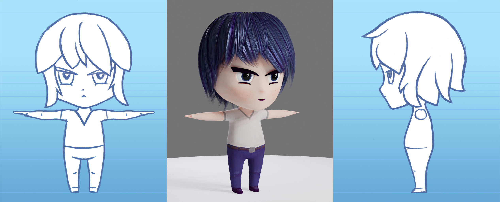

---

## Table of Contents

* [List of Files](#List-of-Files)
* [Shortcuts](#Shortcuts)
* [User Preferences](#User-Preferences)
* [Importing Reference Images](#Importing-Reference-Images)
* [Extrusion](#Extrusion)
* [Loop Cut](#Loop-Cut)
* [Knife Tool](#Knife-Tool)
* [Removing Edges](#Removing-Edges)
* [Filling in Holes](#Filling-in-Holes)
* [Merging Vertices](#Merging-Vertices)
* [Reset Transformations](#Reset-Transformations)
* [Working with a Symmetrical Mesh](#Working-with-a-Symmetrical-Mesh)
  * [X Mirror Option](#X-Mirror-Option)
  * [Mirrored Linked Duplicate](#Mirrored-Linked-Duplicate)
  * [Joining Mirrored Object](#Joining-Mirrored-Object)
  * [Fixing Normals](#Fixing-Normals)
* [Transform Orientation](#Transform-Orientation)
* [Clipping Plane](#Clipping-Plane)
* [Circle Select](#Circle-Select)

---

[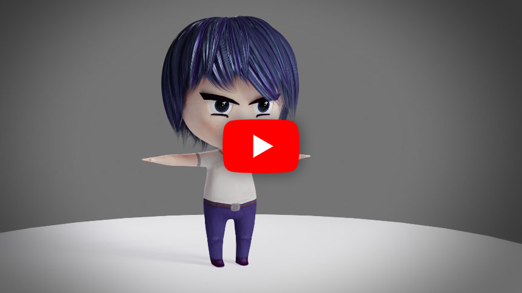](https://youtu.be/twBumdNC0Og)

---

## List of Files

| File Name | Description |
| --- | --- |
| **prefs/userpref.blend** | my user preferences |
| **prefs/lajos.py** | my keymap |
| **model/e2_001.blend** | base project with reference images |
| **model/e2_2.79_001.blend** | base project with reference images, blender 2.79 |
| **model/e2_002.blend** | pelvis |
| **model/e2_003.blend** | torso whole piece |
| **model/e2_004.blend** | arm |
| **model/e2_005.blend** | leg |
| **model/e2_006.blend** | knees/elbows |
| **model/e2_128.blend** | textured model turnaround |
| **model/images/e2_*.png** | ortho images |
| **model/images/eye.png** | eye texture |
| **model/images/texture.png** | mesh texture |

---

## Shortcuts

### General

| Shortcut | Action |
| ---- | ---- |
| **alt-Q** | quad view |
| **N** | toggle sidebar |
| **T** | toggle toolbar |
| **Z** | shading mode |
| **shift-Z** | toggle wireframe/solid shading |
| **alt-Z** | toggle x-ray shading |
| **shift-A** | add object |
| **TAB** | toggle object/edit mode |
| **ctrl-A** | apply transformation |
| **shift-D** | duplicate object |
| **alt-D** | duplicate linked |
| **ctrl-J** | join objects |
| **C** | circle select |
| **alt-A** | deselect |

### Mesh Modeling

| Shortcut | Action |
| ---- | ---- |
| **X** | delete object/component |
| **ctrl-R** | loop cut |
| **K** | knife tool |
| **alt-LMB** | select edge loop |
| **, (comma)** | transform orientation menu |
| **M** | merge (join vertices) |
| **V** | rip (split vertices) |
| **shift-F** | fill polygon (make faces) |

### NURBS Hair Modeling

| Shortcut | Action |
| ---- | ---- |
| **alt-S** | scale at control point |
| **ctrl-T** | rotate at control point |
| **ctrl-L** | select linked |

### Texture Painting

| Shortcut | Action |
| ---- | ---- |
| **S** | sample color (eyedropper) |

---

## User Preferences

I modified some shortcuts for easier and faster workflow.

| Shortcut | Action |
| ---- | ---- |
| **Q** | box select tool |
| **shift-Q** | lasso select tool |
| **W** | move tool |
| **shift-W** | move mode |
| **E** | rotate tool |
| **shift-E** | rotation mode |
| **R** | resize tool |
| **shift-R** | resize mode |
| **1,2,3,4** | vertex, edge, face, uv selection mode |
| **alt-1,2,3,4** | front, perspective, right, top view |
| **MMB** | pan camera |
| **alt-MMB** | tumble camera |
| **wheel** | dolly camera |
| **F** | focus camera on selection |

Use my preferences:

* open **blender**
* close **blender**
* go to the blender 2.80 config folder
  * windows: `%APPDATA%\Blender Foundation\Blender\2.80\config`
  * osx: `/Users/_YOUR_USER_NAME_/Library/Application Support/Blender/2.80/config`
  * linux: `~/.config/blender/2.80/config`
  * note: to find config folder from blender python: `bpy.utils.user_resource('CONFIG')`
* make a backup of the `userpref.blend` file
* copy the `userpref.blend` file from this project to the config folder

This is what the config folder looks like on windows (the original `userpref.blend` renamed to `userpref.blend.bak` (there might be more or less files in there):

Import my keymap:

* in **blender** open **Edit/Preferences**
* select the **Keymap** tab
* click **Import**
* find and open **lajos.py**
* select my keymap (will probably be selected automagically)
* **Save Preferences**

---

## Importing Reference Images

To load the reference ortho images, first add two empty image objects: **Add/Empty/Image** (you can also use the **shift-A** shortcut):

I named the objects **ref_front** and **ref_right**.

Set the location and rotation for the image objects in the **Object** tab:

Load the images in the **Object Data** tab for each image object. Make sure to set **Offset X** to **-0.5** and **Offset Y** to **0** so the images line up to the ground and center of the world:

Create a new **collection** for the reference images in the **Outliner**:

Notice the **cursor**, **eye** and **camera** icons next to collections and objects:

* **cursor** - enable/disable selection of object or collection
* **eye** - show/hide object or collection in viewport
* **camera** - show/hide object or collection in renders

---

## Extrusion

We'll use extrusion as one of the tools to add geometry to our model.

First make sure that you are in **Edit Mode** (**TAB** key) and in **Face** selection mode (**3** key with my awesome keymap):

Select a face or multiple faces. You can use the **Face/Extrude Faces** menu or **ctrl-E** shortcut.

After the extrusion, you can move the new faces, or for more control, hit **ESC** to exit the automatic move mode and use the move tool (**W** key). You can also scale and rotate the new faces.

---

## Loop Cut

We can add resolution to our model by creating new edge loops with the **Loop Cut** tool, **ctrl-R** shortcut.

Make sure **Edge** selection mode is active.

The loop cut tool is context sensitive. It will create new loops based on the orientation of the closest edge to the mouse cursor.

When the loop cut tool is active, the number of new loops can be adjusted by turning the mouse wheel. After clicking the **LMB**, the new edges can be moved, or to leave them in the center, hit the **ESC** key.

---

## Knife Tool

Another tool for creating new edges is the **Knife Tool** (**K** shortcut).

Make sure to start and end on a vertex to avoid adding unwanted vertices (notice the red outline around the green cursor when hovering over a vertex).

---

## Removing Edges

We can remove edges using the delete popup menu (**X** key).

Notice that the **Delete Edges** option also deletes the face, making a hole on the object. A better operation is **Dissolve Edges** that leaves the face intact.

Vertices and faces can also be removed using the same menu.

---

## Filling in Holes

To fill in a hole (create a new face), select the vertices around the hole and use the **shift-F** shortcut (the operation is **New Edge/Face from Vertices** in the **Vertex** menu)

---

## Merging Vertices

Multiple vertices can be welded together from the **Merge** popup menu. The shortcut is **M**.

In this case, we want to fix a slit in the object. The screen left vertex is in the correct position. First select the right vertex, then the left one, and use the **At Last** option from the **Merge** menu to weld the vertices at the position of the last selected vertex.

---

## Reset Transformations

We want our model to be at the center of the field with **Location** set to [0,0,0], **Rotation** [0,0,0] and **Scale** [1,1,1].

To reset transformations, use **Object/Apply** (shortcut **ctrl-A):

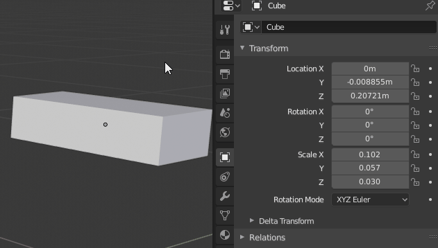

---

## Working with a Symmetrical Mesh

### X Mirror Option

To make symmetrical edits on a mesh, turn on **X Mirror** in **Mesh Options** (note: must be in **Edit Mode** to see the **Mesh Options** menu).

The **Topology Mirror** option tries to match components even if they are not perfectly aligned, but it seems unreliable on low resolution meshes. I found it best to leave it unchecked.

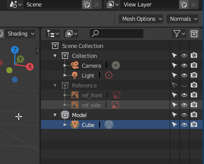

Editing a mesh with **X Mirror**:

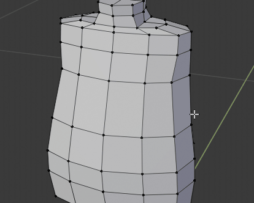

**Note:** this will only work if the object is centered and symmetrical on its origin along the **X** axis:

### Mirrored Linked Duplicate

While the **X Mirror** option works for simple edits, it cannot handle more complex operations like extrusions and the knife tool.

A better workflow is to cut the model in half and create a mirrored linked duplicate that will be automatically updated.

In the **front ortho** view select half of the faces (in **wireframe** mode, otherwise back faces are not selected) and delete them:

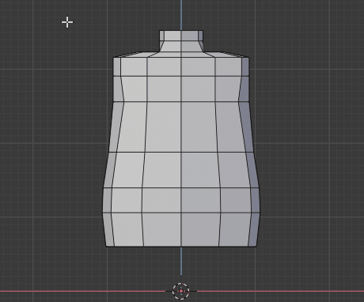

Switch back to **Object Mode** (**TAB** key). Make a linked duplicate of the object (**Object/Duplicate Linked** menu, or **alt-D** shortcut). To make sure that the duplicate is perfectly aligned, hit the **ESC** key to exit the automatic move mode:

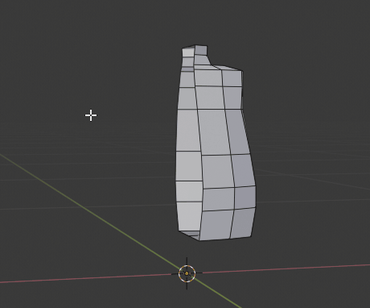

Negate the **X** scale of the duplicate (set to -1.0):

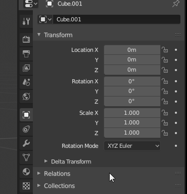

It's good practice to disable selection of the duplicate object and work on the original half:

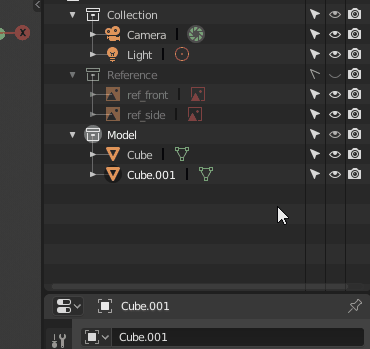

---

### Joining Mirrored Object

To join the mirrored halves back together:

* in **Object Mode** select the two halves
* join them together (**Object/Join** or **ctrl-J** shortcut)
* at this point, there are double vertices in the center. To check:
  * select a vertex by **clicking on it**, not with the box select tool
  * move vertex to see that the object is split
* in **Edit Mode** and **front ortho wireframe view**, select the center vertices
* fix the double vertices with **Vertex/Remove Double Vertices**
* check with the above procedure that the mesh is welded together

### Fixing Normals

Half of the object was flipped, so those faces are now inside out. This will cause issues with rendering.

To check and fix:

* in **Edit Mode** turn on normal display in the **Overlays** menu
  * the normals show which way a face is oriented
  * we want all the blue "porcupine quills" pointing out
* in **wireframe mode**, select all the faces
* use **Mesh/Normals/Recalculate Outward** to fix (the shortcut is **shift-N**)
* turn off normal display

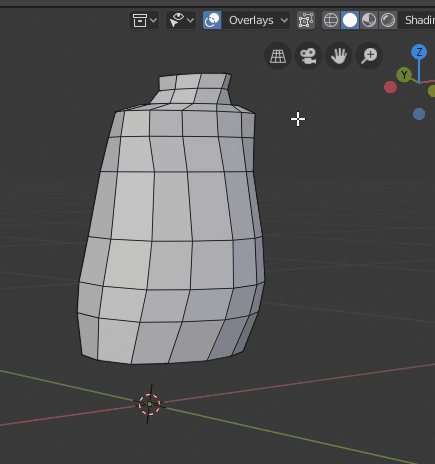

---

## Transform Orientation

The **Global** transform orientation mode uses the scene's coordinate system. It's very useful to make sure that components don't moving on an undesired axis.

The **Normal** mode adjusts the coordinate system to the shape of the object, so it can make shaping the object easier.

The shortcut for the orientation menu is **,** (comma).

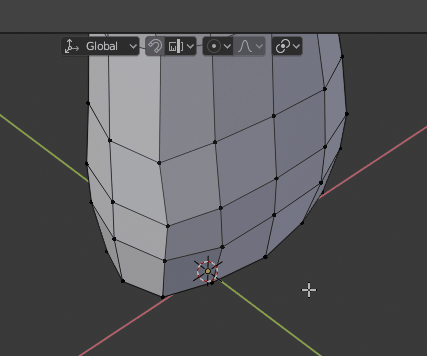

---

## Clipping Plane

When working in close quarters (for example inside the head), the viewport might not show part of the model.

To optimize viewport rendering, there is a minimum and maximum clipping plane, and objects are only shown within this range.

To fix, set the **Clip Start** value smaller in the sidebar. Open with the small arrow in the top right of the viewport, or use the **N** shortcut.

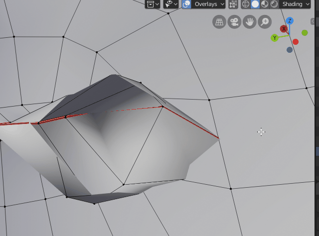

---

## Circle Select

Make selections with a paint brush using the **Circle Select** tool (shortcut **C**).

| Button | Action |
| -- | -- |
| **LMB** | add to selection |
| **MMB** | remove from selection |
| **RMB** | exit tool |
| **wheel** | adjust brush size |

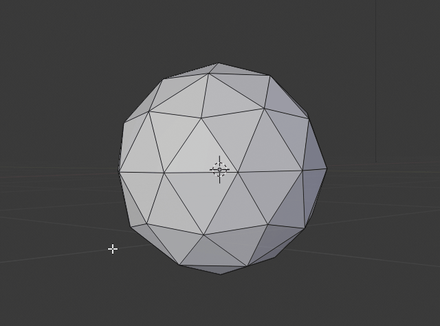

---

_Now you know everything..._

