# Head Modeling Steps

Add a new plane. Rotate it 90 degrees on the X axis, size and move it to match about the height of the nose. Make sure to not move it on the X axis (X location should be zero).

Apply rotation and scale (all rotation values should be 0, all scale values 1).

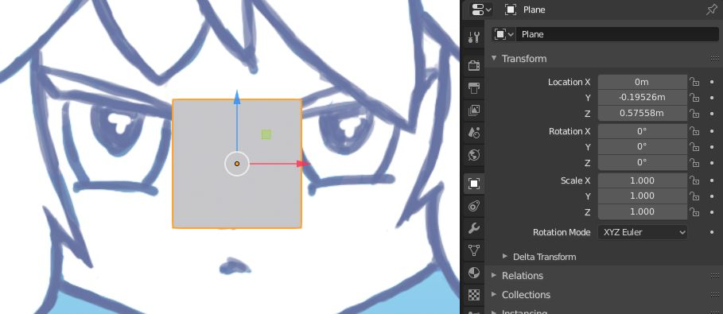

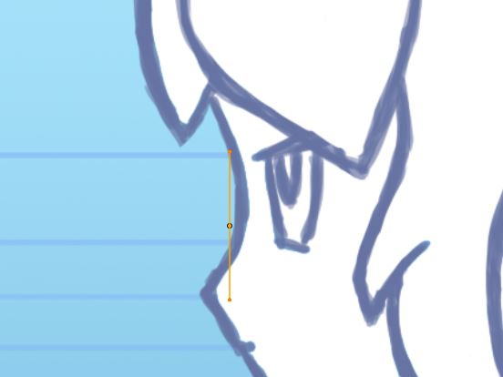

---

Add a mirror modifier, check the **Clipping** option.

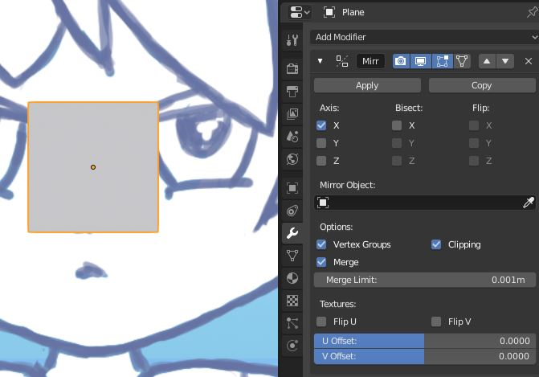

---

In **Edit Mode** move the face over the screen right eye (this will create another face on the left).

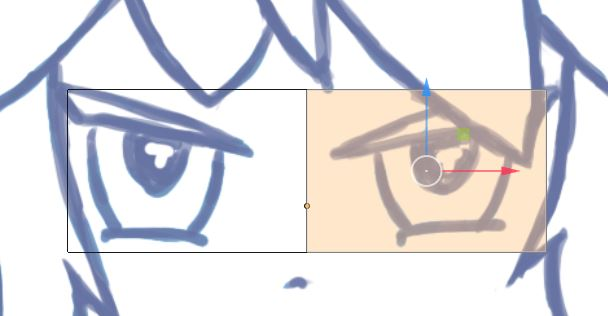

---

Add four loop cuts around the eye.

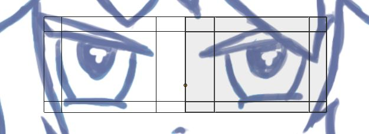

---

Select the three vertices in the upper right corner and merge them to center.

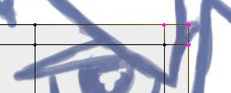

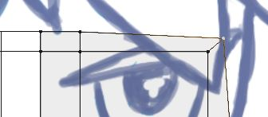

---

Do the same with the three vertices in the bottom right corner.

**Checkpoint:** `e2_head09.blend`

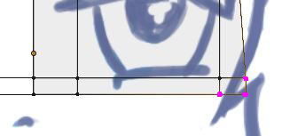

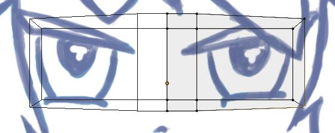

---

Select the bottom edge and extrude it down.

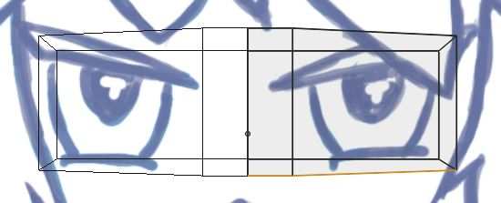

---

Line up this vertex to the jaw in front view.

**Checkpoint:** `e2_head12.blend`

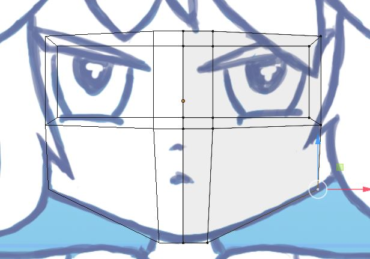

---

Move the three side vertices back according to the side reference.

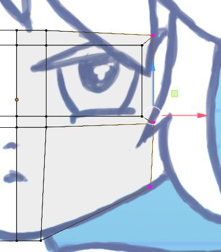

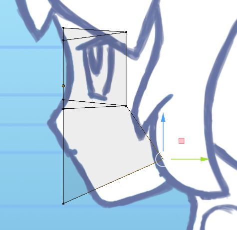

---

Select the two vertices to the right of the eye and move them back.

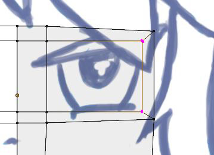

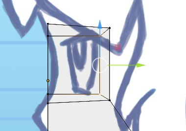

---

Extrude these two faces in. Use the scale tool if having issues with the extrusion tool.

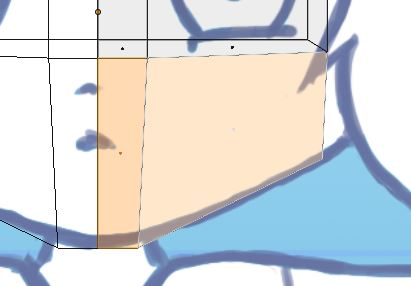

---

Line up the new vertices to the mouth in both front and side view.

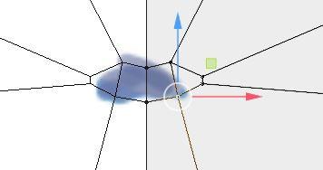

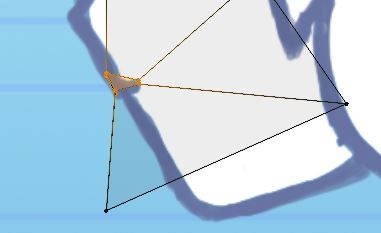

---

Delete the two faces over the mouth.

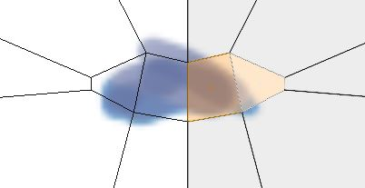

---

Select the edge loop around the lips (**alt+click**) and extrude them in. Line up the new vertices to the center of the mouth.

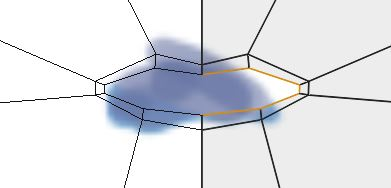

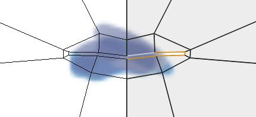

---

Add an edge loop around the mouth, just under the nose.

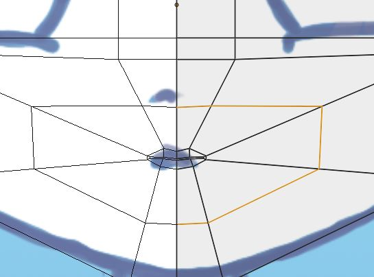

---

Add another edge loop around the mouth, just above the tip of the nose.

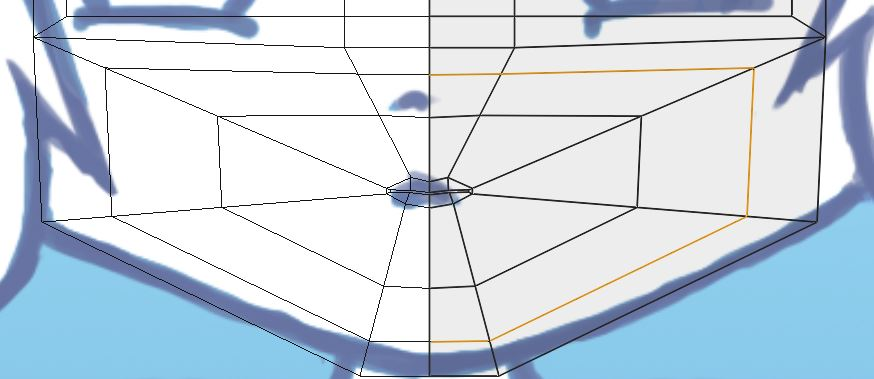

---

Smooth out the new loops by moving the vertices. Check in all views.

**Checkpoint:** `e2_head29.blend`

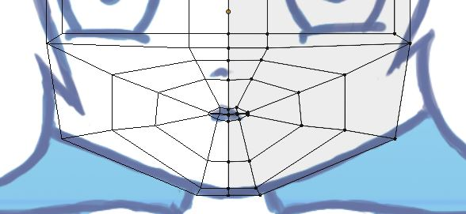

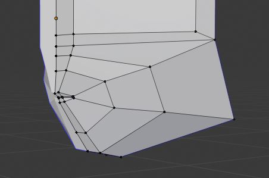

---

Add an edge loop through the left side of the eye...

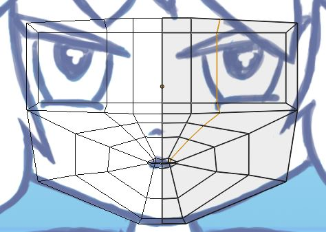

... and another edge loop across the eye.

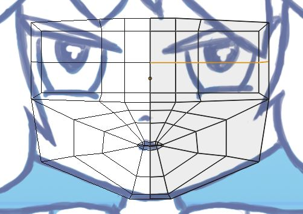

---

Select this vertex and delete it. This should create a hole for the eye.

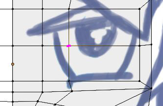

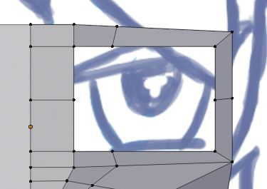

---

Shape the edges around the eye and the edges running along the nose.

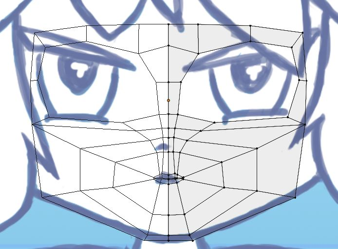

---

Select the edge loop around the eye and extrude it in twice.

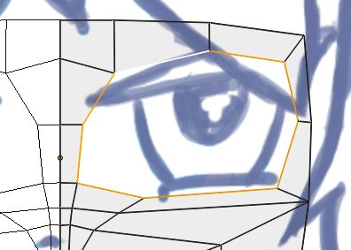

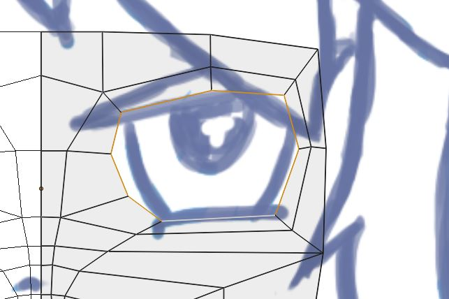

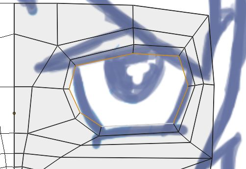

---

Add another edge loop below the eye.

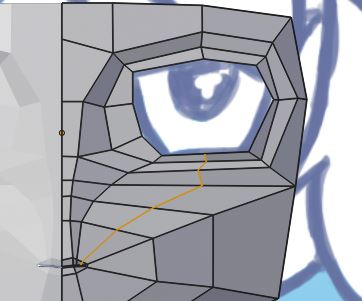

---

At this point it's useful to create eyeballs as a reference for adjusting the shape of the eyelids.

**Checkpoint:** `e2_head39.blend`

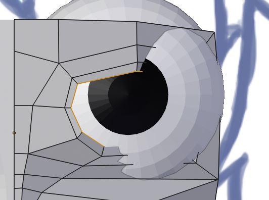

---

Select these two faces and extrude them forward for the nose.

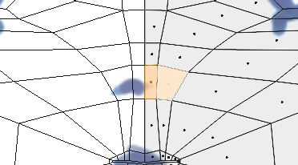

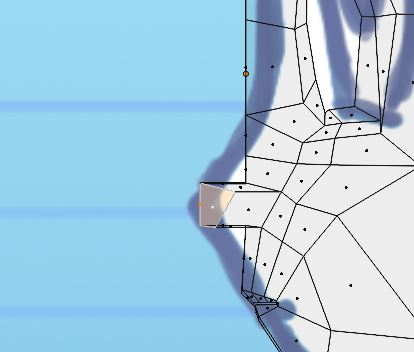

---

Move the nose vertices to match the reference image in side view.

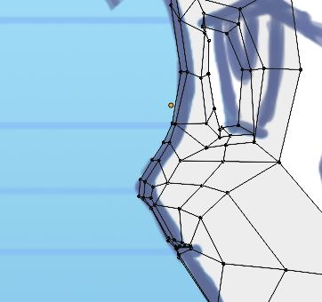

The front should look similar to this:

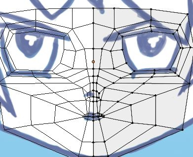

---

Add an edge loop through the tip of the nose. Shape the new loop so it's nice and smooth.

**Checkpoint:** `e2_head45.blend`

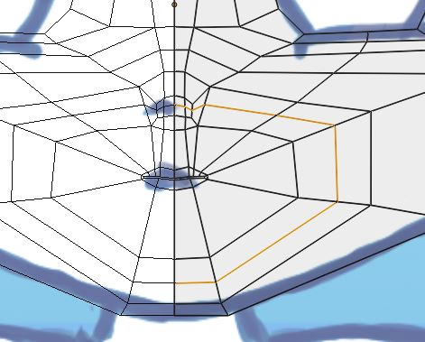

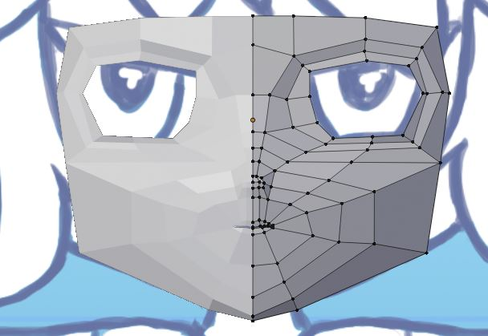

---

Add an edge loop from the tip of the mouth.

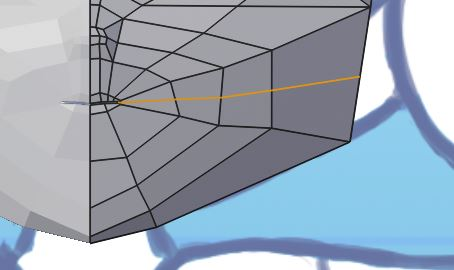

---

Add an edge loop to the jaw.

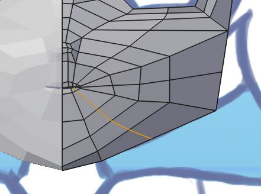

---

Adjust the new vertices so it looks something like this from the side:

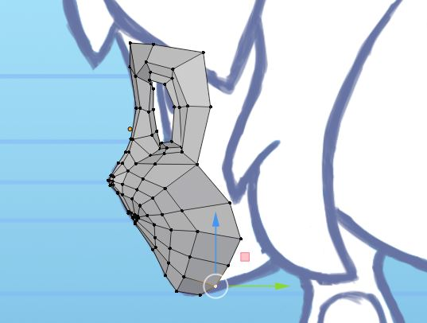

---

Select these edges and extrude them back.

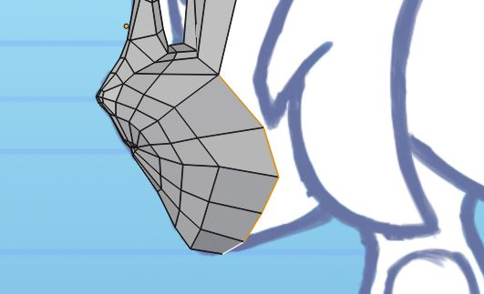

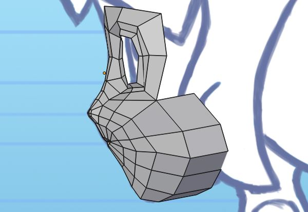

---

Merge these two vertices at their center center.

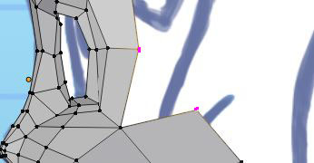

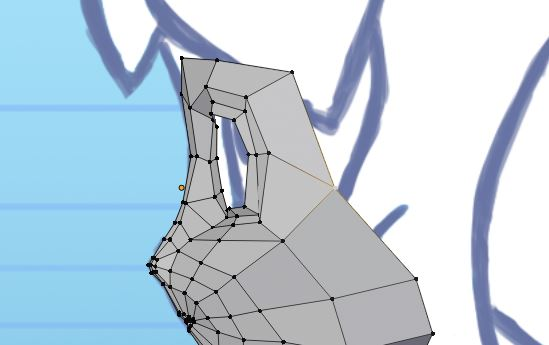

---

Make sure that the vertices at the top of the face are equally spaced horizontally.

Select these edges around the top of the face and extrude them up.

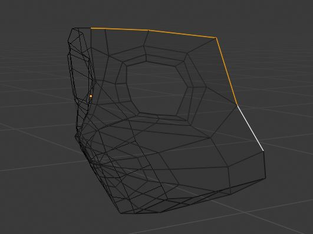

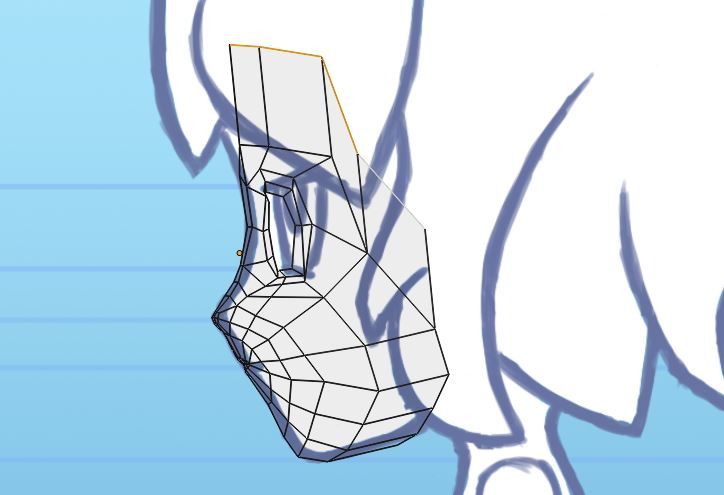

---

Adjust the new vertices so they make a straight-as-possible line in side view.

---

Extrude the top edge 7 times, rotating after each extrusion, to create the shape of the rest of the head.

---

Select these four vertices and fill them in (**shift-F**). Repeat the same for the next three faces.

**Checkpoint:** `e2_head58.blend`

---

Select these edges at the bottom of the jaw and extrude them back three times.

---

Merge these vertices at the bottom of the head.

**Checkpoint:** `e2_head62.blend`

---

The neck can be extruded from these faces.

---

**Checkpoint:** `e2_head63.blend`
